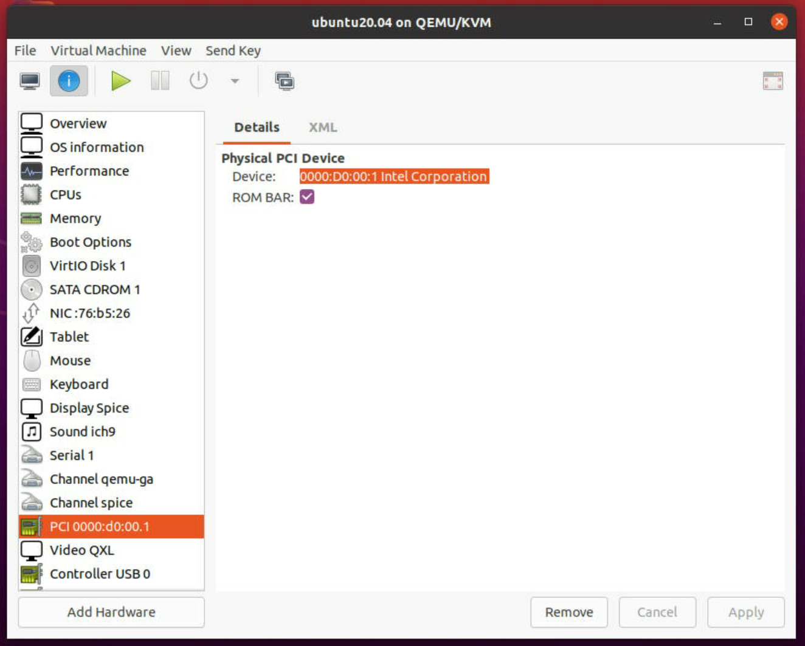
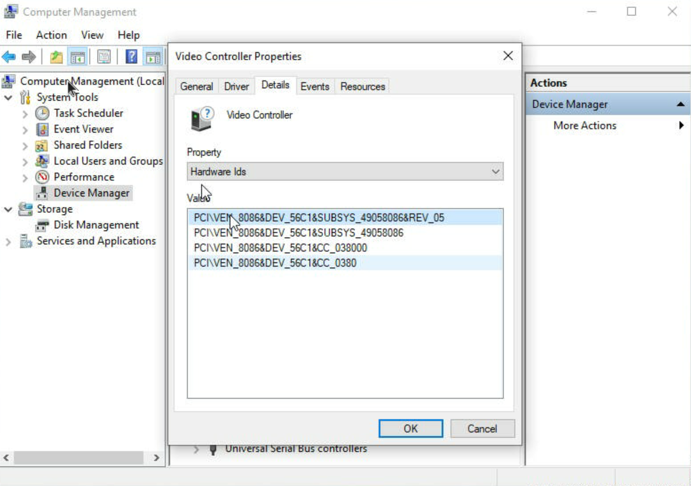

# Enable SR-IOV on ATSM

**`This guide is applied to Ubuntu 20.04 only.`**

### BIOS Settings:

**Coyote Pass M50CYP**:

```
Advanced → Integrated IO Configuration → Intel ® VT for Directed IO →Enabled
Advanced → PCI Configuration → SRIOV Support → Enabled
Advanced → Processor Configuration → Intel Virtualization Technology → Enabled 
Boot Maintenance Manager → Change Boot Order → ‘UEFI Internal Shell’ at top of list 
Advanced → PCI Configuration → Memory Mapped I/O Size → 1024G 
Advanced → PCI Configuration → MMIO High Base →56T 
Advanced → PCI Configuration → Memory Mapped I/O above 4GB → Enable
```


### **Host OS Settings:**

**Driver preparation :**

​	please refer to this  [link](https://dgpu-docs.intel.com/installation-guides/ubuntu/ubuntu-focal.html)

**Change kernel boot parameters:**

```
$ sudo vi /etc/default/grub
```

​	change GRUB_CMDLINE_LINUX

```
GRUB_CMDLINE_LINUX="intel_iommu=on iommu=pt i915.enable_guc=0x7"
```

​	update grub and reboot

```
$ sudo update-grub 
$ sudo reboot 
```

 	check the dmesg and confirm the SR-IOV is working.

```
$ dmesg |grep SR-IOV
[   11.821253] i915 0000:d0:00.0: Running in SR-IOV PF mode
```

​	The PCI ID **0000:d0:00.0** will be used in next steps.  It could be different in your system.

**Create VFs**:

​	NOTE: replace the card1 with your actual card name, here 2 VMs for example. 

```
$ sudo -i
# echo '0' | tee -a /sys/bus/pci/devices/0000:d0:00.0/sriov_drivers_autoprobe
# echo '2' | tee -a /sys/class/drm/card1/device/sriov_numvfs
# echo '1' | tee -a /sys/bus/pci/devices/0000:d0:00.0/sriov_drivers_autoprobe
```

​	Setup the ID for VF.   56c0 for atsm-150, 56c1 for atsm-75

```
# modprobe vfio-pci
# echo '8086 56c0' | tee -a /sys/bus/pci/drivers/vfio-pci/new_id
```

​	Then 2 new PCI devices will be created , and the ID will be used when installing the guest OS.

```
0000:d0:00.1
0000:d0:00.2
```

**Create VMs:**

​	install qemu and related software

```
$ sudo apt-get install qemu-kvm virt-manager bridge-utils
```

 	start the virt-manage in gnome-shell and setup the VM 

```
$ sudo virt-manager
```

​	add the VF and install the guest OS.  Select the PCI ID **0000:d0:00.1** like below snapshot.



After the guest OS is installed and boot up, you should be able to find out the device in the system.

ubuntu 20.04:

```
$ lspci | grep Display
04:00.0 Display controller: Intel Corporation Device 56c1 (rev 05) 
```

 windows 10:



Install the driver to the Guest OS.